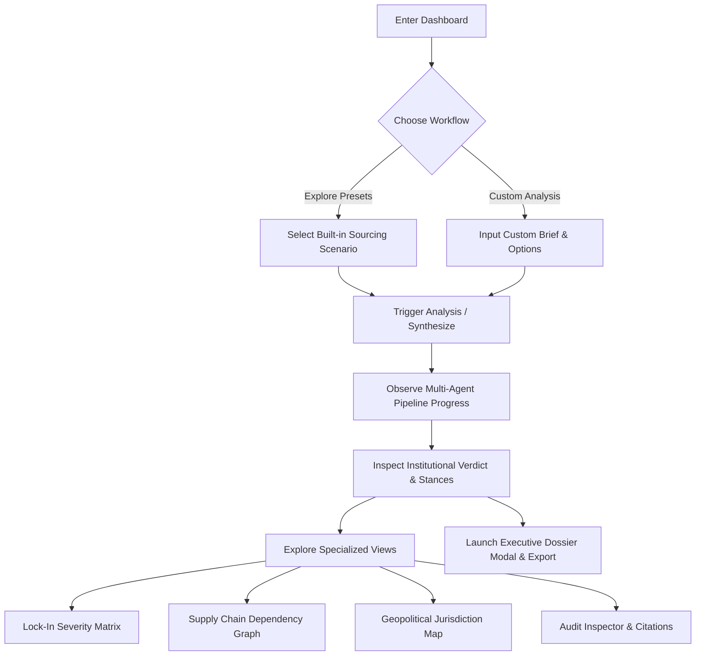

# 03 — UX flows (marketing website & terminal workstation)

---

## 1. Marketing Website User Journeys

### Flow 1: First-Time Visitor (Product Evaluator)
- **Entry:** Lands on `/` (Home).
- **Engagement:** Reads the strategic sourcing fork teaser, checks the three core pillars, and inspects the 6-stage pipeline preview.
- **Deep-Dive:** Clicks "See the architecture" → `/architecture` to review the interactive Mermaid conditional graph and recalibration sequence.
- **Conversion:** Clicks "Enter dashboard" to experience live analysis.

### Flow 2: Academic Evaluator / Thesis Reviewer
- **Entry:** Direct link or navigation from Home.
- **Path:** Clicks `/about` to read the premise, narrative drop-cap prose, and target persona analysis.
- **Action:** Scrolls to Section 6 ("Helios Terminal Synopsis") and clicks "Download" to retrieve `Helios-Terminal-Synopsis.docx`.
- **Secondary:** Visits `/team` to review member responsibilities across the multi-agent pipeline.

### Flow 3: Returning Decision Maker
- **Entry:** Any marketing route.
- **Action:** Clicks the persistent top-right "Enter dashboard" CTA immediately without scrolling.

---

## 2. Transition into the Terminal Workstation

Navigating to `/dashboard` triggers an instant client-side route transition:
1. **Atmosphere Shift:** The canvas changes from warm sand bone (`#F7F3EE`) to dark Bloomberg terminal (`#0E1013`).
2. **Command Navigation:** The marketing header is replaced by `BloombergHeader`, complete with system telemetry, UTC time, preset selector, and view tabs.
3. **Telemetry & Connection:** A live health check (`GET /health`) verifies backend readiness.

---

## 3. Workstation Operational Flows (`/dashboard`)

### Flow 4: Rapid Scenario Evaluation via Presets
1. In `BloombergHeader`, user selects a pre-configured scenario from the dropdown:
   - *Example 1: Drone SLM Sovereign Defence* (UK MoD)
   - *Example 2: Ministry Medical SLM* (NHS Sovereign Health AI)
   - *Example 3: Autonomous Fleet Perception Stack*
2. Workstation immediately updates inputs, projected cost curves, and comparative risk metrics.
3. Audio chime confirms scenario activation.

### Flow 5: Running a Custom Decision Analysis
1. User enters custom organization (e.g. `Federal Aviation Administration`), capability (e.g. `Air Traffic Routing LLM`), and candidate sourcing paths in `BloombergDecisionConsole`.
2. User clicks `[ANALYZE SOURCING VECTORS]`.
3. Audio `goCommand` plays; state shifts to `submitting` → `polling`.
4. The user watches real-time agent progression in the `AgentPipelineTopology` tab.
5. Upon arrival at status `completed`, success chime plays and the `InstitutionalVerdictPanel` renders comparative rankings, failure modes, and lock-in matrices.

### Flow 6: Forensic Audit Inspection
1. User switches to the `Audit Inspector` tab.
2. The user inspects cross-stage claims generated by upstream agents.
3. Verifies that every assertion has a corresponding source citation (`grounded_in`) rather than an ungrounded inference (`inference`).

### Flow 7: Generating Executive Dossier
1. User clicks `[EXECUTIVE DOSSIER]` in the workstation top bar.
2. `ExecutiveDossierModal` opens displaying a formatted executive briefing memo.
3. Memo contains key institutional verdict, recommended option, cost trajectories, and mitigation guidelines, formatted for print or PDF export.
