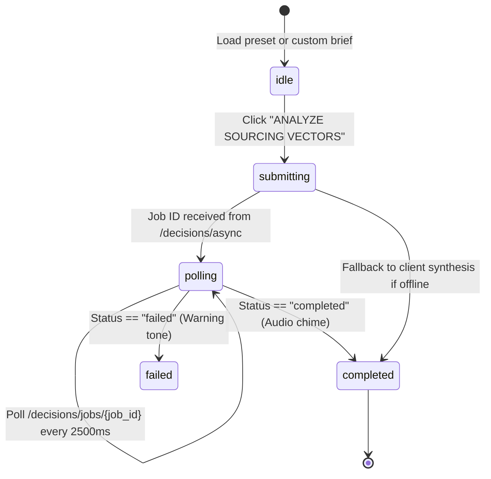

# 09 — Dashboard workstation architecture (`/dashboard`)

The **Helios Terminal Dashboard** is a high-density, Bloomberg-style decision intelligence terminal designed for defense analysts, ministry procurement teams, and enterprise leadership evaluating sovereign AI sourcing tradeoffs.

It operates as the functional product workspace linked directly from the marketing website.

---

## 1. Aesthetic & Design Language

- **Visual Tone:** High-density dark terminal aesthetic (`--dash-bg: #0E1013`, `--dash-surface: #14171C`, `--dash-border: #23272F`).
- **Brand Continuity:** Shares the signature teal accent (`#3FA7B3`) with the marketing site.
- **Typography:** Monospace data displays (`IBM Plex Mono`), crisp sans-serif headers (`Inter`), and high-contrast status colors (`#3FB950` success, `#F85149` danger, `#D29922` warning).
- **Audio Feedback (`terminalAudio.ts`):** Synthesizes browser-native Web Audio API clicks, execution chimes, and warning alerts without external MP3 files.

---

## 2. Architecture & Workstation State Machine

The dashboard state is managed via React hooks in `src/dashboard/pages/DashboardPlaceholder.tsx`:

### State Definitions
- `idle`: Awaiting user input or preset selection.
- `submitting`: Dispatches `POST /decisions/async` to FastAPI backend.
- `polling`: Asynchronously queries job execution status (`POLL_INTERVAL_MS = 2500`).
- `completed`: Renders multi-agent comparative verdict, graphs, matrices, and audit trail.
- `failed`: Displays fatal verification exceptions or validation bottlenecks.

---

## 3. Workstation Views (`ActiveWorkstationTab`)

The terminal header (`BloombergHeader.tsx`) offers 6 specialized operational tabs:

| Tab ID | View Name | Focus Area |
| --- | --- | --- |
| `quadrant` | **4-Split Command Console** | Simultaneous overview: Input console, trajectory forecast, verdict synthesis, and audit log. |
| `topology` | **Agent Pipeline Topology** | Full-width real-time visualization of the 6 core agents and their 18 sub-agents. |
| `supply_chain` | **Global Supply Chain Graph** | Interactive nodal graph illustrating hardware, model weight, and provider dependencies. |
| `matrix` | **Lock-In Severity Matrix** | Layer-by-layer exposure breakdown (Compute, Weights, Data, Support, Legal). |
| `geopolitical` | **Geopolitical Risk Map** | Global jurisdiction risks, sanctions vulnerability, and export controls. |
| `audit` | **Audit Inspector** | Forensic audit trail displaying claim citations, verification gates, and grounding ratios. |

---

## 4. Component Breakdown (`src/dashboard/components/`)

### Core Navigation & Control
- **`BloombergHeader.tsx`:**
  - Real-time UTC operational clock, system uptime, and memory utilization telemetry.
  - Active preset scenario selector (`PRESET_SCENARIOS`).
  - Workstation tab switcher (`quadrant`, `topology`, `supply_chain`, `matrix`, `geopolitical`, `audit`).
  - Live backend connection status beacon (`http://127.0.0.1:8000/health`).
  - "EXECUTIVE DOSSIER" quick-modal launcher.

- **`BloombergDecisionConsole.tsx`:**
  - Entity prompt (e.g. `UK Ministry of Defence`).
  - Capability scope (e.g. `Low-Latency Tactical Edge SLM`).
  - Sourcing paths under evaluation (Build Private vs License Model vs Outsource API).
  - Pre-configured quick-presets for rapid live demonstrations.

### Synthesis & Risk Visualization
- **`InstitutionalVerdictPanel.tsx`:**
  - Sovereign recommendation stance (`RECOMMENDED`, `HIGH CAUTION`, `DISQUALIFIED`).
  - Composite lock-in score, switching friction index, and jurisdictional hazard score.
  - Key failure modes and contractual traps.

- **`TrajectoryChartPanel.tsx`:**
  - Built with `Recharts`.
  - Multi-year projections (Year 1 to Year 5) comparing total cost of ownership (TCO) vs dependency severity over time for all evaluated paths.

- **`LockInMatrixView.tsx`:**
  - Detailed cross-stack layer analysis across:
    1. Compute & Infrastructure (GPU clusters, hardware lock-in)
    2. Model Weights & Architecture (open weights vs proprietary black-box API)
    3. Tooling & Orchestration (runtime dependencies)
    4. Fine-Tuning Data Sovereignty (data exfiltration risks)
    5. Vendor Support & Maintenance (SLA cliff hazards)

### Pipeline Transparency & Auditing
- **`AgentPipelineTopology.tsx`:**
  - Visual layout tracking the sequential 6-stage lifecycle:
    `Ingestion` → `Stack Mapping` → `Scenario Generation` → `Outcome Prediction` → `Dependency Diagnosis` → `Comparative Verdict`.
  - Staggered node animation indicating verification checkpoints and active sub-agent tasks.

- **`AuditInspector.tsx` & `AuditTrail.tsx`:**
  - Cross-stage claim verification ledger.
  - Verification pass/fail indicators, confidence scores, and source grounding badges (`grounded_in` vs `inference`).

- **`IntelFeedPanel.tsx`:**
  - Live intelligence feed aggregating retrieved evidence from web search (Tavily), HuggingFace Hub registries, and BIS Entity Lists.

- **`BloombergGlobalMap.tsx` & `BloombergSupplyChainGraph.tsx`:**
  - Interactive SVG map and vector graph mapping physical data centers, semiconductor origin points, and vendor corporate jurisdictions.

- **`ExecutiveDossierModal.tsx`:**
  - High-level decision memo formatted for institutional review boards, exportable or printable directly from the workstation.

---

## 5. Client-Side Offline Synthesis Engine

To guarantee resilience during offline reviews, academic presentations, or API quota limits:
- If the live FastAPI backend at `http://127.0.0.1:8000` is unreachable, `DashboardPlaceholder.tsx` automatically detects connection status and executes an instant client-side synthesis fallback.
- The fallback maps the entity brief against `src/dashboard/data/presetScenarios.ts`, delivering a fully populated, verifiable comparative verdict without degrading the UI experience.
